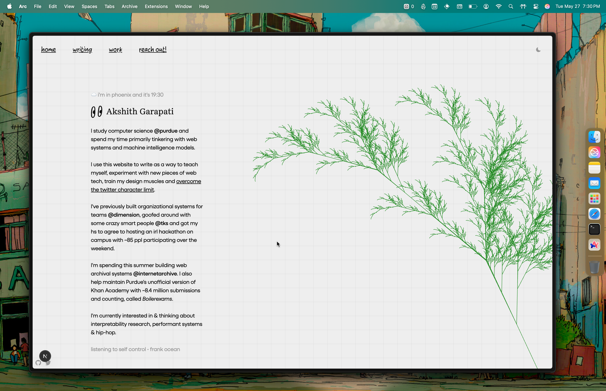

# akshith.io

🔨: You can run it by simply cloning, running `pnpm i` followed by `pnpm dev` and visiting `localhost:3000`. You will also need to create a `.env` and fill in the environment variables listed in `.env.example` for all functionality to work as expected. Additionally you will need to create a `public/fonts` directory and fill that in with the fonts of your choosing, which may require replacing imports across many pages and editing `utils/fonts.ts`. Built with Next, Tailwind & Typescript.

---

`akshith.io` is my personal website. It is primarily a visual home for personal context, location, and music status.



This website implicitly relies on my CLI tool [`adot`](https://github.com/akshithio/akshith.io) for the `<LocationStatus>` component to work as expected. Additionally, fonts are loaded using a private GitHub repo before build time to protect font licensing requirements. The project structure is as follows:

```
src/
├── app/                   # Next.js app directory
│   └── page.tsx           # Home page
├── components/            # React components
│   ├── layout/            # Shared layout components
│   └── pages/             # Page-specific components
├── icons/                 # SVG icons
└── utils/                 # Utility functions and fonts
```

### Contributing

Feel free to submit issues and enhancement requests! If you want to contribute:

1. Fork the repository
2. Create your feature branch (`git checkout -b feature/amazing-feature`)
3. Commit your changes (`git commit -m 'Add some amazing feature'`)
4. Push to the branch (`git push origin feature/amazing-feature`)
5. Open a Pull Request

### License

This project is licensed under the [MIT License](LICENSE).

<br />

&nbsp; that's where the username comes from! - akshithio - may 2025
